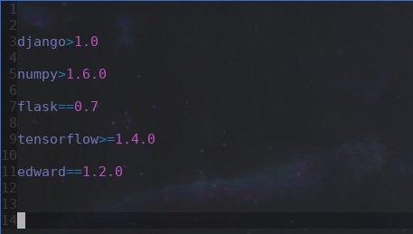
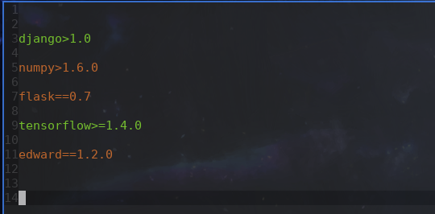

# Python Requirements Installer (pir)


## Abstract

The package provides helpful hints while editing the *requirements.txt* file in python projects. With the utility installed, the missing from pip&rsquo;s index packages are highlighted with &ldquo;warning&rdquo; color and the present ones with &ldquo;success color&rdquo;. This should act as a prompt to call a function that will go over the missing packages and will install them with `pip install`.


The idea for Emacs-package came to me while I was reading an article comparing Emacs and PyCharm and one of the &ldquo;pros&rdquo; of PyCharm was it ability to tell you when a package from requirements.txt is missing and to install it for you. So there you go, Emacs has now has that feature too!


For easy *requirements.txt* editing I also recommend the [pip-requirements](https://github.com/Wilfred/pip-requirements.el) package. It provides minor mode and auto-completion for the packages in your *requirements.txt* file.


### Screenshots

 


## Installation

Currently the project is not on [Melpa](https://melpa.org/) so you&rsquo;ll have to download it and loaded in your init file manually. Just clone the repository

    git clone https://github.com/palikar/python-requirements-installer

and put something like

```emacs-lisp
(load "/your/path/to/pir.el")
```


### Dependencies

-   The packages uses a library for easy creation of overlays - [ov.el](https://github.com/ShingoFukuyama/ov.el). You probably have to have that installed on your Emacs in order to be able to use *pri*.


## Usage

The package provides a minor mode &#x2013; `pri-mode` &#x2013; that gets automatically added to the `auto-mode-alist` and get activated every time you open a *requirements.txt* file. Al of the provided function must be used while the this minor mode is active. The provided by the package keybindings are on their own key-map &#x2013; `pri-mode-map`. The default prefix key is `C-c -` and it is customizable. The provided for now functions are given in the following table.

| Keybinding   | Function               | Description                                                                                |
|------------ |---------------------- |------------------------------------------------------------------------------------------ |
| `<prefix> v` | `pri-check-packages`   | Checks all of the packages in a requirements.txt file<br>and annotates them appropriately. |
| `<prefix> i` | `pri-install-packages` | Goes over the uninstalled packages and prompts you to<br>install each of them.             |
| `<prefix> c` | `pri-clear-checks`     | Clears the annotations created by `pri-check-packages`                                     |

Each time you save a *requirements.txt* file <span class="underline">and</span> the `pri-mode` is active, the `pri-check-packages` function will be called. You&rsquo;ll be therefore frequently notify about the missing and present *pip* packages.
